# 
 SOFTWARE DEVELOPMENT PLAN 

## Statement of Purpose and Scope

- Application's primary reason to give straightforward 4 ingredient recipe plan for each day of the week. All the recipes provided are 4 ingredients or less and very valuable for the clients who have a very bustling way of life and an amateur at their cooking expertise. For convenience, App providers list of the ingredients which would be used in the recipes. It displays an entire list of kitchen inventory rather than ingredients of the particular recipe to make it easy shopping for the entire week. At last, the same ingredients from the list can be moved/created to the new shopping list and display individual price as well as the total price for the entire kitchen inventory order. This would enable the user to make a solitary time process  
-  It will resolve the issue of finding and looking for the recipe for the day and afterwards purchase ingredients, instead, all ingredients will display at once and make shopping for grocery much easier. Further, all recipes consist of 4 ingredients only, that would make fewer items to add into a shopping list and shorter time for the cooking.
- All the recipes provided are 4 ingredients or less and extremely valuable for the users who have a very busy lifestyle and a beginner at their cooking skill. It would provide a productive tool while ordering kitchen inventory. Price list with each item would be helpful for a user to keeps in the spending limit.
- User will be given information about the application and how to use the guide at the beginning of the app. Then, the user will be prompted to submit the day of the week. After chose day, the user will be given a recipe for the day. kitchen stock will be shown as a rundown for the client to look at what things are of stock from their kitchen stock. Once a list will be displayed, the user can create their shopping list and add item and price from the list. once added the items, the application would provide a list of the items ordered and what is the price for the item. The application would end with a display of the total amount for the kitchen inventory shopping.

##  Features	

There are three main features has been included in the application

1. Meal planning
    
    ---use of variables and the concept of variable scope
        -I use names of the days as a variable to create recipe for a day

    --- loops and conditional control structures
        - loop has been created for user input for the day 
        -- there is second loop has been established to connect recipe with the days
        ---
    - error handling 
        - begin and rescue has been implemented to the days part if user do not select or mis spell the word they should get error message\
        - Inside the loop also else has been used to prior error handling

    Application's primary component is to give simpler 4 ingredients meal planning to the user with essential cooking aptitudes. Without searching for cooking recipes user can simply type the day of the week and it will allow them to access recipe for the day. It should provide different recipes to different days selected by a user.This features helps to find recipe without specific recipes for four ingredients or less. This feature also eliminates idea for decision making as it gives recipe without any other option. This would make cooking and shopping process faster and easier. Through the straight forward day selection and recipe selection gives better opportunity for user lacking technical skills. 

2. Kitchen inventory list display

        ---use of variables and the concept of variable scope
            - name and created as a variable to save user input 
            - Hash has been used for saving item names and price
        
         --- loops and conditional control structures
            - keys and values of the kitchen inventory item will be displayed through the method
            
         --- error handling
            - user will be able to create own items or can change the spelling , this feature has been added to make additional items
              which are not used for recipe 

    The second feature of the app is to display an entire kitchen inventory through an array. Item name and price are placed on aginst each other which would give a list type display and easier for a user to see the name of the item and price. Also, with the use of colorizing gem it would give different colors to each item in different Items names. This is specifically designed for the user who has difficulty looking at the list and can not distinguish between different lines. It would likewise push the client to rapidly pickup things which are out of stock instead of recollecting.

3. Shopping for kitchen inventory 

        ---use of variables and the concept of variable scope
            - list variable been created for user to create new list for kitchen inventories 
            - variable total price has been given 0 value at the start and later to store total amount of the order
        
         --- loops and conditional control structures
            - three different structure has been combined in this feature
            - first its creating list , second adding items and price to the list , printing list and total amount of the order 

         --- error handling
            - if user puts price as a string still it would display as a price but will not add to the total amount
            

    This is one of the significant highlights of the application. It takes things and cost and store as a rundown. It would allow the saved list to display the total name of the item of items and price as well as the total price for item purchased. By using file write method it would save the list for user in text file where user can print the list.This feature enable user to create list and purchase item in one go rather than creating list and purchase item separately.For, the simpler shopping experience consolidates both the strategies in a single system. 

##  User Interaction and Experience

    - how the user will find out how to interact with / use each feature

    --- user will have a step by step information when the app will start
    ---the prompt with messages will guide user what is expected and how to use it

    - how the user will interact with / use each feature
    ---each feature will have message display guiding a user what they require to do

    - how errors will be handled by the application and displayed to the user
    --- errors has been displayed with the messages e.g. when selecting a day which is not in the list user will be getting "please selct the day" or if they misspell more than few times they will get "this is not correct input please enter day"

## Control flow diagram

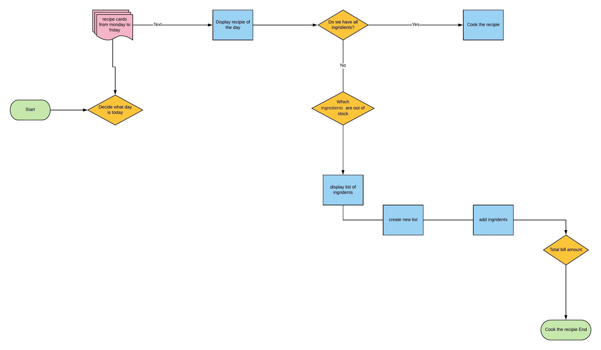  

## 	Implementation Plan

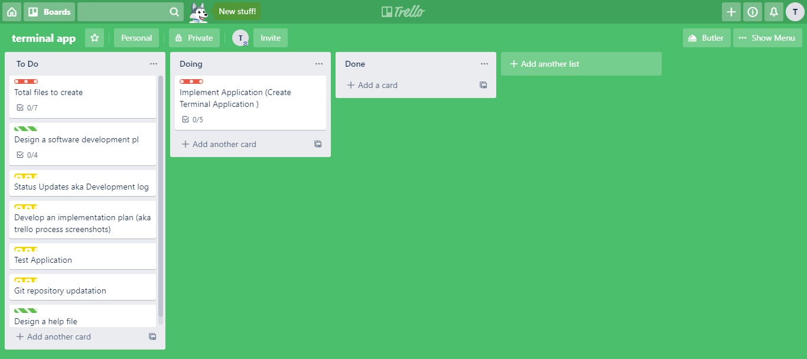  

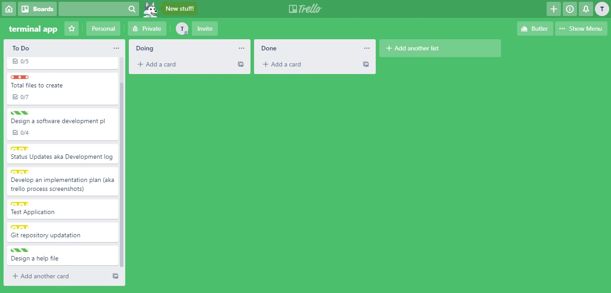  

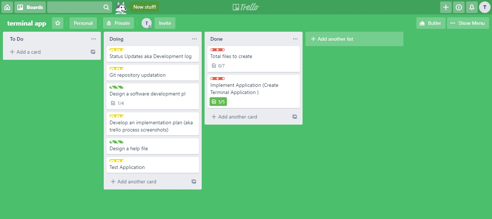  

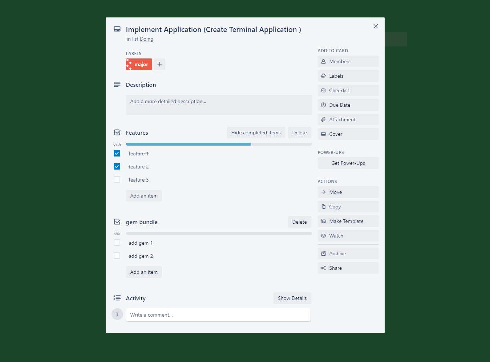  

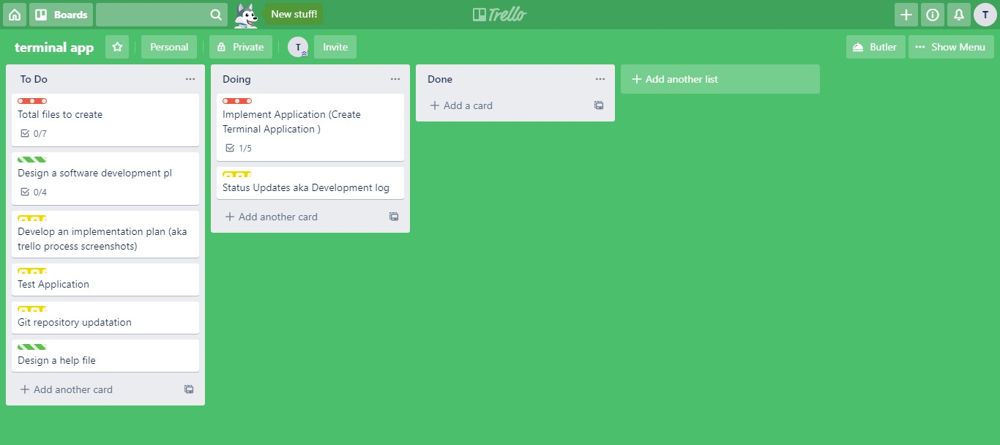  

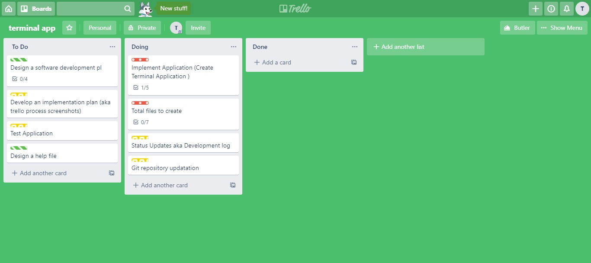  

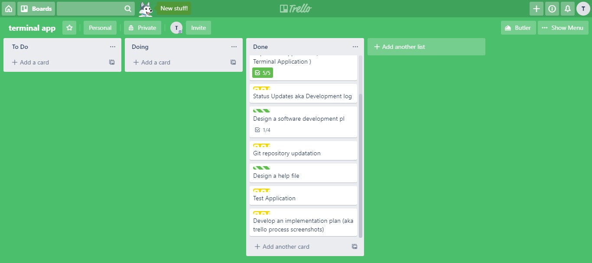  

  

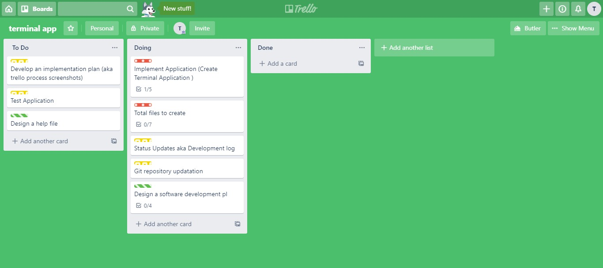  

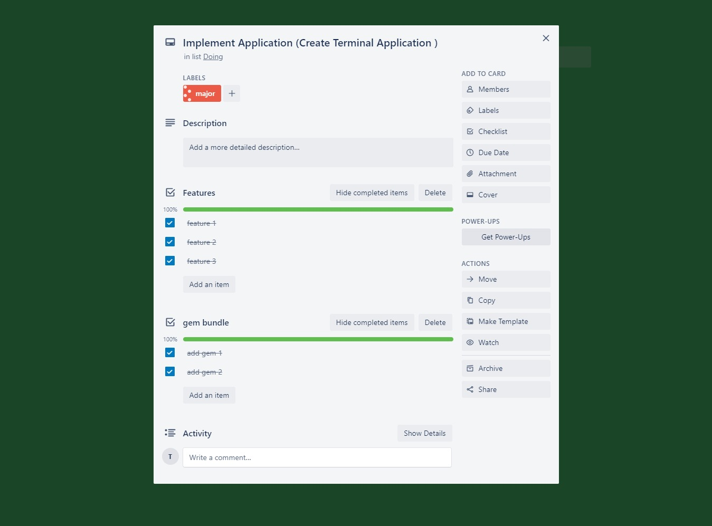  

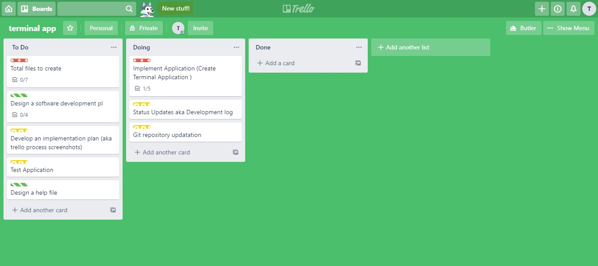  

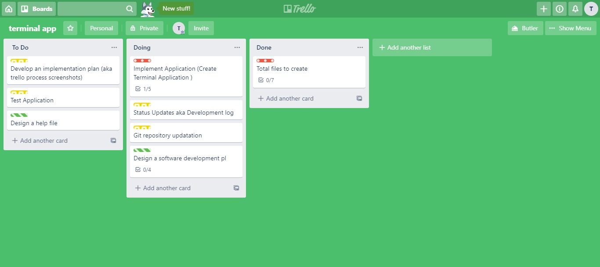  

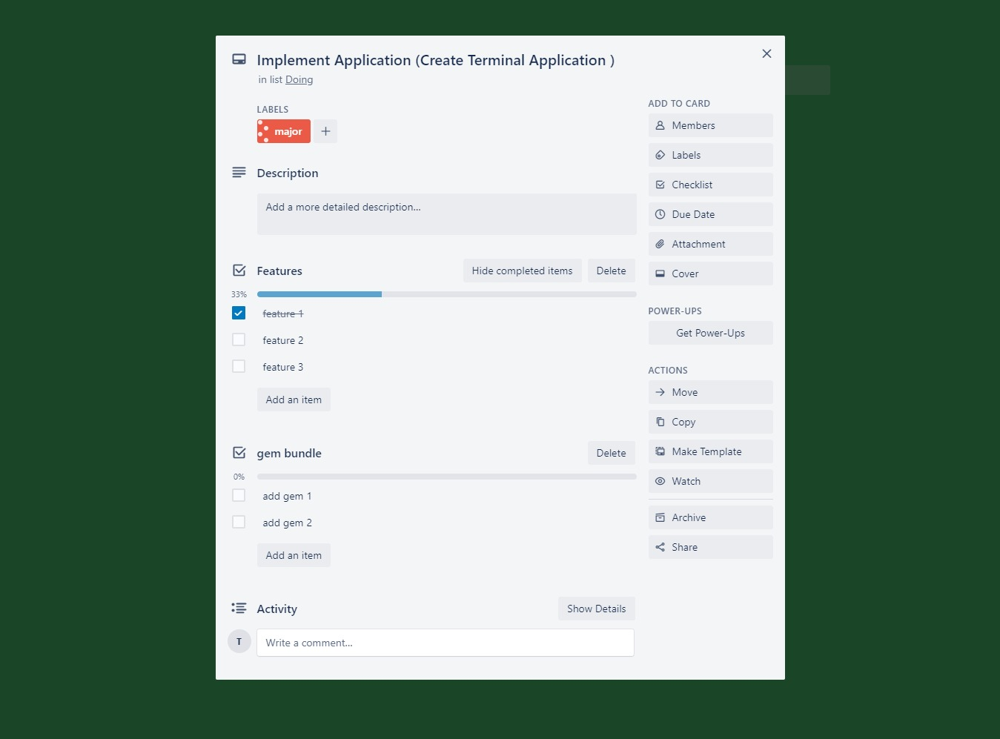  

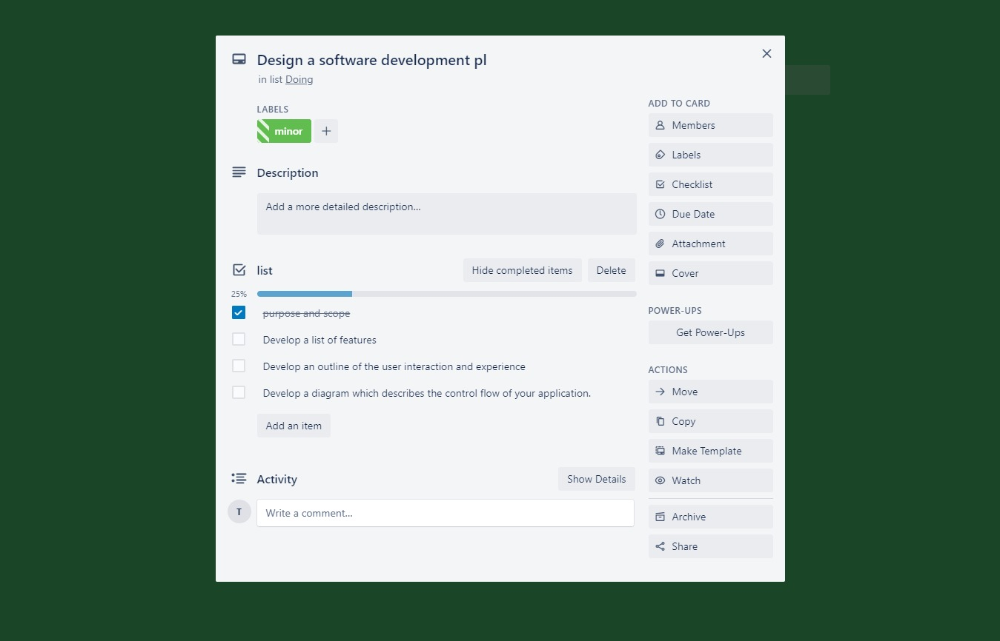  

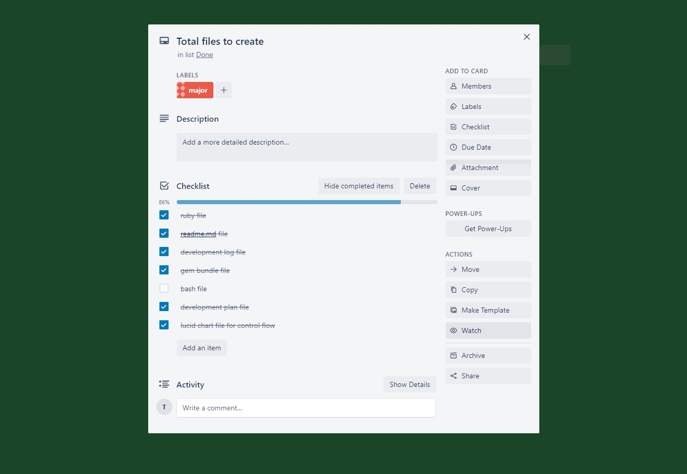  

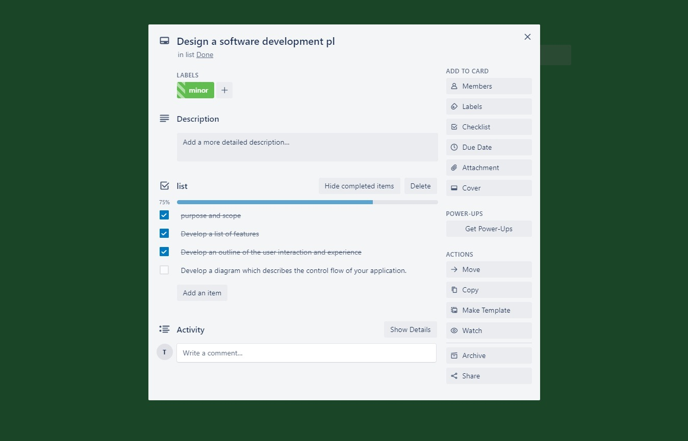  

## Git hub commits and status

